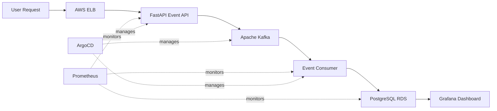

# 
🌐 Multi-Region Distributed Analytics Platform

[](https://aws.amazon.com/eks/)
[](https://kubernetes.io/)
[](https://terraform.io/)
[](https://argoproj.github.io/cd/)
[](LICENSE)

> **A production-grade, cloud-native event ingestion and analytics platform demonstrating modern DevOps/SRE practices.** Built for scalability, observability, and auto-healing with complete GitOps automation.

**Perfect for**: Technical Interviews • Portfolio Projects • Learning Cloud-Native Architecture

---

## 🎯 Project Overview

This platform showcases a **complete event-driven microservices architecture** running on AWS EKS, featuring:

- ✅ **Real-time event ingestion** via FastAPI REST API
- ✅ **Asynchronous message processing** with Apache Kafka
- ✅ **Persistent data storage** on AWS RDS PostgreSQL
- ✅ **GitOps continuous delivery** using ArgoCD
- ✅ **Full observability stack** with Prometheus & Grafana
- ✅ **Self-healing infrastructure** on Kubernetes
- ✅ **Infrastructure as Code** with Terraform
- ✅ **Cost-optimized** (~$5-15/month with Spot instances)

**Use Case**: Capture user events (clicks, page views, actions) from web/mobile apps, process them asynchronously through Kafka, store in PostgreSQL for analytics, and visualize metrics in real-time.

---

## 🏗️ Architecture

### **[🚀 View Interactive Architecture Diagram →](https://shantanup108.github.io/multi-region-analytics/architecture.html)**

<div align="center">
  
  <p><em>Click to explore the full interactive architecture</em></p>
</div>

### High-Level Data Flow



**Tech Stack Summary**: FastAPI • Kafka • PostgreSQL • Kubernetes • AWS EKS • Terraform • ArgoCD • Prometheus • Grafana

---

## ✨ Key Features

### 🚀 Core Functionality
- **Event Ingestion API**: High-performance REST endpoint built with FastAPI/Uvicorn
- **Message Queue**: Kafka decouples producers from consumers for scalability
- **Data Pipeline**: Python consumer processes Kafka messages → PostgreSQL
- **Health Monitoring**: `/healthz` and `/metrics` endpoints for K8s probes

### 🏗️ Infrastructure & DevOps
- **GitOps Workflow**: ArgoCD auto-syncs K8s manifests from GitHub
- **Auto-Healing**: Kubernetes recreates failed pods in <60 seconds
- **Infrastructure as Code**: Complete AWS setup in Terraform
- **Cost-Optimized**: EC2 Spot instances + t3.micro nodes (~$5-15/month)
- **Multi-AZ Deployment**: Worker nodes spread across availability zones

### 📊 Observability & Monitoring
- **Metrics Collection**: Prometheus scrapes app and system metrics
- **Visualization**: Grafana dashboards (CPU, memory, pod health, event rates)
- **Structured Logging**: JSON logs across all services
- **Alerting Ready**: Configurable alerts via Prometheus Alertmanager

### 🔒 Production-Ready
- **Security**: IAM roles, VPC isolation, security groups
- **Scalability**: Horizontal Pod Autoscaling configured
- **Reliability**: Readiness/liveness probes, resource limits
- **High Availability**: LoadBalancer with AWS ELB

---

## 🛠️ Technology Stack

| Layer | Technologies |
|-------|-------------|
| **API Layer** | FastAPI, Uvicorn, Python 3.11 |
| **Message Queue** | Apache Kafka, Zookeeper |
| **Database** | PostgreSQL 15 (AWS RDS) |
| **Container Orchestration** | Kubernetes 1.29, Helm 3 |
| **Cloud Infrastructure** | AWS EKS, RDS, VPC, IAM, EC2 Spot |
| **GitOps** | ArgoCD 2.9 |
| **Monitoring** | Prometheus, Grafana, CloudWatch |
| **Infrastructure as Code** | Terraform 1.6+ |
| **Development** | Docker, Docker Compose, Minikube |

---

## 📦 Project Structure

```
multi-region-analytics/
├── event-api/                    # FastAPI event ingestion service
│   ├── app/
│   │   ├── main.py              # API routes and Kafka producer
│   │   └── models.py            # Pydantic models
│   ├── Dockerfile
│   └── requirements.txt
│
├── event-consumer/               # Kafka → PostgreSQL consumer
│   ├── consumer.py              # Message processing logic
│   ├── Dockerfile
│   └── requirements.txt
│
├── k8s/                          # Kubernetes manifests
│   ├── event-api-deployment.yaml
│   ├── event-consumer-deployment.yaml
│   ├── kafka-deployment.yaml
│   ├── postgres-deployment.yaml
│   ├── nginx-service.yaml
│   └── monitoring/
│
├── infra/terraform/              # Infrastructure as Code
│   ├── main.tf                  # EKS cluster + RDS
│   ├── vpc.tf                   # Network configuration
│   ├── iam.tf                   # IAM roles and policies
│   └── variables.tf
│
├── docs/                         # Documentation
│   ├── architecture.html        # Interactive diagram
│   ├── screenshots/
│   └── DEPLOYMENT.md
│
├── docker-compose.yml            # Local development
└── README.md
```

---

## 🚀 Quick Start

### Prerequisites

**For Local Development**:
- Docker & Docker Compose
- Git

**For AWS Deployment**:
- AWS CLI configured
- Terraform >= 1.6
- kubectl >= 1.28
- Helm >= 3.0

---

### 🏠 Local Development (Minikube/Docker Compose)

#### Option 1: Docker Compose (Fastest)

```bash
# Clone repository
git clone https://github.com/ShantanuP108/multi-region-analytics.git
cd multi-region-analytics

# Start all services
docker-compose up --build

# Test event ingestion
curl -X POST http://localhost:8000/events \
  -H "Content-Type: application/json" \
  -d '{
    "user_id": "user123",
    "event_type": "page_view",
    "url": "https://example.com/products",
    "timestamp": "2024-11-01T10:30:00Z"
  }'

# Verify in database
docker-compose exec db psql -U postgres -d events \
  -c "SELECT * FROM event_log ORDER BY timestamp DESC LIMIT 5;"
```

#### Option 2: Minikube (Kubernetes Local)

```bash
# Start Minikube
minikube start --cpus=4 --memory=6144

# Build images in Minikube's Docker
eval $(minikube docker-env)
cd event-api && docker build -t event-api:latest .
cd ../event-consumer && docker build -t event-consumer:latest .

# Deploy to Minikube
kubectl apply -f k8s/

# Access services
kubectl port-forward svc/event-api 8000:8000
kubectl port-forward -n monitoring svc/grafana 3000:80
```

**Important**: For Minikube, set `imagePullPolicy: IfNotPresent` in deployments!

---

## ☁️ AWS Cloud Deployment (Production)

### Step 1: Provision AWS Infrastructure

```bash
cd infra/terraform

# Initialize Terraform
terraform init

# Review infrastructure plan
terraform plan

# Deploy to AWS (creates EKS, RDS, VPC, IAM)
terraform apply
# Type 'yes' to confirm
```

**Resources Created**:
- ✅ EKS cluster with managed node group (Spot instances)
- ✅ RDS PostgreSQL database
- ✅ VPC with public subnets across 2 AZs
- ✅ IAM roles for EKS and worker nodes
- ✅ Security groups and network ACLs

**Estimated Cost**: ~$5-15/month with Spot instances

---

### Step 2: Configure Kubernetes Access

```bash
# Update kubeconfig to connect to EKS
aws eks update-kubeconfig \
  --region ap-northeast-1 \
  --name analytics-eks

# Verify connection
kubectl get nodes
```

---

### Step 3: Deploy Application Services

```bash
# Deploy all Kubernetes manifests
kubectl apply -f k8s/

# Wait for pods to be ready
kubectl get pods --watch

# Get LoadBalancer DNS
kubectl get svc nginx-lb
```

---

### Step 4: Access Services

#### Event API (via AWS ELB)
```bash
# Get LoadBalancer DNS
LOAD_BALANCER_DNS=$(kubectl get svc nginx-lb -o jsonpath='{.status.loadBalancer.ingress[0].hostname}')

# Test event ingestion
curl -X POST http://${LOAD_BALANCER_DNS}/events \
  -H "Content-Type: application/json" \
  -d '{"user_id":"test","event_type":"click","url":"http://demo.com"}'
```

**Example LoadBalancer DNS**:
```
a0fdc675cb9644b07b260177711a4b92-1941794578.ap-northeast-1.elb.amazonaws.com
```

#### Grafana Dashboard
```bash
kubectl port-forward -n monitoring svc/grafana 3000:80
# Open http://localhost:3000
# Login: admin / admin
```

#### ArgoCD UI
```bash
kubectl port-forward -n argocd svc/argocd-server 8080:443
# Open https://localhost:8080
# Get admin password:
kubectl -n argocd get secret argocd-initial-admin-secret \
  -o jsonpath="{.data.password}" | base64 -d
```

---

## 📊 Observability & Monitoring

### Prometheus Metrics

The platform exposes and collects:
- **Application Metrics**: Request rate, latency, error rate
- **Kafka Metrics**: Consumer lag, message throughput
- **System Metrics**: CPU, memory, disk, network
- **Custom Metrics**: Events processed/second, queue depth

### Grafana Dashboards

Pre-configured dashboards:
1. **Cluster Overview** (ID: 315): Node health, pod status, resource usage
2. **Namespace Resources** (ID: 6086): Per-namespace metrics
3. **Pod Resources** (ID: 3662): Individual pod performance
4. **Node Exporter** (ID: 1860): Linux host metrics

### Quick Setup

```bash
# Add Helm repos
helm repo add prometheus-community https://prometheus-community.github.io/helm-charts
helm repo add grafana https://grafana.github.io/helm-charts
helm repo update

# Create monitoring namespace
kubectl create namespace monitoring

# Install Prometheus
helm install prometheus prometheus-community/prometheus \
  --namespace monitoring

# Install Grafana
helm install grafana grafana/grafana \
  --namespace monitoring \
  --set adminPassword='admin'

# Port-forward to access
kubectl port-forward -n monitoring svc/grafana 3000:80
kubectl port-forward -n monitoring svc/prometheus-server 9090:80
```

**Grafana Data Source**: `http://prometheus-server.monitoring.svc.cluster.local:80`

---

## 🔄 GitOps with ArgoCD

### How It Works

1. Developer pushes manifest changes to GitHub
2. ArgoCD detects changes (polling or webhook)
3. ArgoCD syncs cluster state with Git state
4. Health checks ensure successful deployment
5. Auto-rollback on failure

### Installation

```bash
# Install ArgoCD
kubectl create namespace argocd
kubectl apply -n argocd -f https://raw.githubusercontent.com/argoproj/argo-cd/stable/manifests/install.yaml

# Access UI
kubectl port-forward svc/argocd-server -n argocd 8080:443

# Get initial password
kubectl -n argocd get secret argocd-initial-admin-secret \
  -o jsonpath="{.data.password}" | base64 -d
```

### Create Application

```bash
# Via CLI
argocd app create multi-region-analytics \
  --repo https://github.com/ShantanuP108/multi-region-analytics.git \
  --path k8s \
  --dest-server https://kubernetes.default.svc \
  --dest-namespace default \
  --sync-policy automated \
  --auto-prune \
  --self-heal
```

### Chaos Engineering Test

```bash
# Delete a pod to test auto-healing
kubectl delete pod <event-api-pod-name>

# Watch ArgoCD and K8s recover
kubectl get pods --watch
# New pod should appear in <60 seconds
```

---

## 🧪 Testing & Validation

### Health Checks

```bash
# API health
curl http://${LOAD_BALANCER_DNS}/healthz

# Prometheus metrics
curl http://${LOAD_BALANCER_DNS}/metrics
```

### Load Testing

```bash
# Install Apache Bench
sudo apt-get install apache2-utils

# Create test payload
cat > event.json <<EOF
{"user_id":"load-test","event_type":"click","url":"http://test.com"}
EOF

# Send 1000 requests with 10 concurrent users
ab -n 1000 -c 10 -p event.json -T application/json \
  http://${LOAD_BALANCER_DNS}/events
```

### Database Verification

```bash
# Port-forward to RDS (via bastion or kubectl run)
kubectl run psql-client --rm -it --image=postgres:15 -- \
  psql -h <rds-endpoint> -U postgres -d events

# Query events
SELECT event_type, COUNT(*) 
FROM event_log 
GROUP BY event_type 
ORDER BY COUNT(*) DESC;
```

---

## 💰 Cost Optimization

### Current Setup (~$5-15/month)

| Service | Configuration | Monthly Cost |
|---------|--------------|--------------|
| EKS Control Plane | Managed K8s | ~$73 |
| EC2 Spot Instances | t3.micro × 2 | ~$10 |
| RDS PostgreSQL | db.t3.micro | ~$15 |
| Network Load Balancer | Standard | ~$16 |
| Data Transfer | Minimal | ~$1
